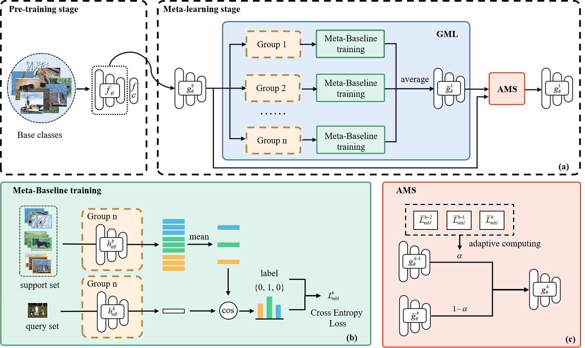

# MGML: Momentum Group Meta-Learning for Few-Shot Image Classification

The goal of Few-Shot Image Classification (FSIC) is to quickly learn new classes of features from few images. At present, image classification covers more and more fields, and it is often difficult to obtain enough data for learning in some specific scenarios, such as medical fields, personalized customization of robots, etc. The meta-learning method has become the mainstream method for FSIC due to its good performance. However, it still has the problems of poor generalization ability and easy to be disturbed by low-quality images. In order to solve the above problems, this paper proposes Group Meta-Learning (GML) and Adaptive Momentum Smoothing (AMS) methods. GML obtains an ensemble model by grouping and training multiple episodes in parallel, which can reduce the interference of low-quality samples and improve the stability of meta-learning training. AMS includes the adaptive momentum update rule, which optimizes the further integration of integrated models between different groups, so that the model can memorize experience in more scenarios and enhance the generalization ability of the model. The combination of the above two methods can achieve a better effect of Few-Shot Learning (FSL), which is recorded as Momentum Group Meta-Learning (MGML). We conduct experiments on miniImageNet, tieredImageNet and CIFAR-FS datasets. The results show that MGML improves the accuracy, stability and cross-domain transfer ability of FSIC, and can be applied to different FSL models.




## Main result

5-way accuracy (%) on miniImageNet

|         Method         |        1-shot        |        5-shot        |
| :--------------------: | :------------------: | :------------------: |
|     Meta-Baseline      |  62.97  $\pm$ 0.75   |   79.22 $\pm$ 0.58   |
|   Meta-Baseline+GML    |   63.52 $\pm$ 0.47   |   79.20 $\pm$ 0.34   |
| **Meta-Baseline+MGML** | **63.65 $\pm$ 0.77** | **79.36 $\pm$ 0.58** |

5-way accuracy (%) on tieredImageNet

|         Method         |        1-shot        |        5-shot        |
| :--------------------: | :------------------: | :------------------: |
|     Meta-Baseline      |  68.63  $\pm$ 0.87   |   82.56 $\pm$ 0.56   |
|   Meta-Baseline+GML    |   69.17 $\pm$ 0.86   |   83.10 $\pm$ 0.55   |
| **Meta-Baseline+MGML** | **69.49 $\pm$ 0.86** | **83.72 $\pm$ 0.58** |

5-way accuracy (%) on CIFARFS

|         Method         |         1-shot         |         5-shot         |
| :--------------------: | :--------------------: | :--------------------: |
|     Meta-Baseline      |   75.86 ${\pm}$ 0.77   | **87.35 ${\pm}$ 0.52** |
| **Meta-Baseline+MGML** | **76.34 ${\pm}$ 0.78** |   87.33 ${\pm}$ 0.52   |

## Experiment

### Requirements

 pytorch = 1.10.0

python = 3.9

### Dataset

Please download [miniImagenet](https://drive.google.com/file/d/1fJAK5WZTjerW7EWHHQAR9pRJVNg1T1Y7/view),   [tieredImagenet](https://drive.google.com/file/d/1nVGCTd9ttULRXFezh4xILQ9lUkg0WZCG/view) and [CIFARFS](https://drive.google.com/file/d/1GjGMI0q3bgcpcB_CjI40fX54WgLPuTpS/view) datasets respectively and put them in the materials folder （You need to create a folder called \textit{materials}）. The directory of the materials folder added to the dataset should be as follows：

./materials

｜—— cifar-fs

​ ​ ​   		⎣—— （Place extracted files）

｜—— mini-imagenet

​ ​ ​ 	   	⎣—— （Place extracted files）

⎣—— tiered-imagenet

​ ​ ​     ⎣—— （Place extracted files）

### Running code

The experiment is divided into pre-training stage, meta-learning stage and testing stage. You can choose to train on the designated GPU(e.g. `gpu 0,1` ).  You need to create a folder called \textit{save} and \textit{log}. During the training, the training log is placed in the log folder, and the saved model parameters are in the save folder.

#### 1. Pre-training stage

We train 100 epochs with 128 batch size on miniImageNet, and learning rate decays at epoch 90. On tieredImagNet, we train 120 epochs with 512 batch size, and the learning rate decays at epoch 40 and 80. You can run the code as follows：

```shell
python train_classifier.py --config configs/train_classifier_[dataset].yaml --gpu 0,1
```

[dataset] can be mini and tiered. You can download the pre-trained model from this [link](https://drive.google.com/drive/folders/1DnsEGlOBGSiD0rz2qHDgNVODQV6WkQEi?usp=sharing).

#### 2. Meta-learning stage

When training the baseline, the batch size is set to 4 in 1-shot and 5-shot. When training MGML, the number of meta-learning groups is set to 5. Unlike the baseline, the batch size of Mini-ImageNet and CIFAR-FS is set to 1 under the 1-shot setting, and remains the same under other settings. To shorten the training time, you can set $B_{upper}$ (upper in code) to a smaller value. We set $B_{upper}= 1$ on two datasets. To train baseline, you can run the code as follows：

```shell
python train_meta_MGML --batch_size 4 --task_nums 1 --momentum 1.0 --upper 1.0 --config configs/train_meta_[dataset].yaml
```

You can change N-way K-shot setting in the yaml files. [dataset] can be mini, tiered and cifars. If you want to train MGML you can change the three parameters batch_size, group_nums and momentum (change it to 1.0). 

#### 3. Testing stage

To test the performance, change the setting `load_encoder` in `configs/test_few_shot.yaml`  to the model parameters saved in the meta-learning stage. Then run: 

```shell
python python test_few_shot.py --shot 1
```

